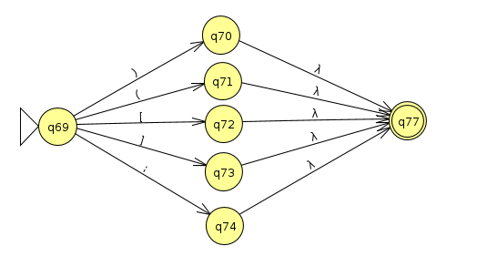
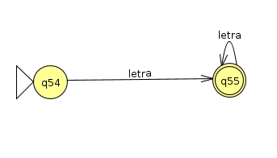

# Faltam

* Analisador Sintatico (in progress ...)
* Analisador Semantico
* Gerador de Representação Intermediária

# To Do

* Implementar a gramatica
 - Provavelmente cada derivação sera uma função
 - Ex :
          def derivar_I():
            if tk.type == rwd and tk.attribute == programa :
              proc_B
            else
              return False
            return True
* Implementar firts and follow
* Implementar Analisador sintatico preditivo baseado em descida recursiva

# Gramática
* I &rightarrow; programa B
* B &rightarrow; inicio D C fim
* D &rightarrow; T ident ; D | £
* T &rightarrow; int |  char | real
* C &rightarrow; se Ç entao B C | enquanto Ç B C | E C | £
* Ç &rightarrow; ( X R X )
* E &rightarrow; A ; | M ;
* A &rightarrow; ident = X ;
* M &rightarrow; ident O M | X
* O &rightarrow; + | - | * | /
* X &rightarrow; ident | Const
* R &rightarrow; == | <> | >= | <= | > | <

Obs.: Como a grámatica usada não possui recursão a esquerda, não foi necessário usar técnicas de remoção de recursão indereta/direta. Além disso a gramática não teve que passar por um processo de fatoração, não tem ambiguidade.

# Tokens

* Palavras Reservadas : programa, inicio, fim, int, se, enquanto, entao, faca, para, char, real
* Identificador
* Constante : char, int, real
* Pontuação : '(' , ')' , ';' , '[' , ']'
* Operadores : +, -, *, /
* Operadores Relacionais : >, <, >=, <=, ==, <>

# Expressões Regulares

## Padrões Base
* letra  = (a|b|...|z|A|B|...Z)
* digito = (0|1|...|9)
* numero = (+|-)? digito digito*
* float  = (+|-)? digito digito* (, digito digito*)?
* string = 'letra*'

## Padrões Tokens

* Palavras Reservadas &rightarrow; p(rograma|ara) | in(icio|t) | f(im|aca) |  en(quanto|tao) | se | char | real
* Identificador &rightarrow; letra letra*
* Operadores Relacionais &rightarrow;  =(=)? | <(>|=)? | >(=)?
* Operadores &rightarrow;  + | - | * | /
* Pontuacao &rightarrow; ( | ) | [ | ] | ;  
* Constante &rightarrow; numero | string | float

# Diagramas

## AFD

## AFND

## Palavras Reservadas

## Constantes

## Operadores Relacionais

## Pontuação

## Operadores

## Identificadores

